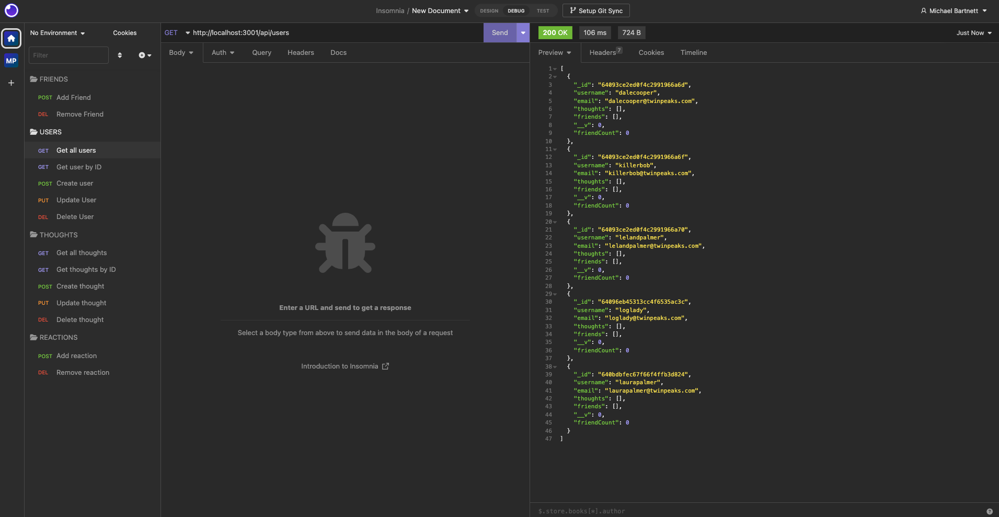

# NoSQL-Social-Network-API

&nbsp;&nbsp;&nbsp;&nbsp;&nbsp;
&nbsp;&nbsp;&nbsp;&nbsp;&nbsp;
&nbsp;&nbsp;&nbsp;&nbsp;&nbsp;
&nbsp;&nbsp;&nbsp;&nbsp;&nbsp;

## Description

A social network web application using Express.js for routing, a MongoDB database, and the Mongoose ODM.

## Table of Contents

&bull; [Installation & Testing](#installation--testing) 
&bull; [Usage](#usage) 
&bull; [License](#license) 
&bull; [How to Contribute](#how-to-contribute) 
&bull; [Questions](#questions)

## Installation & Testing

To install and test this application, you will need to have the following tools and software installed on your computer:

&bull; [Node.js](https://nodejs.org/en/)  
&bull; [MongoDB](https://www.mongodb.com/)  
&bull; [Insomnia](https://insomnia.rest/) (or a similar API client for testing)

Here are the steps to get started:

&bull; Clone the repository to your local machine. 
&bull; Install the Node dependencies by running `npm install` in the root directory of the project. 
&bull; Start the MongoDB server in your terminal or command prompt. 
&bull; Start the server by running `npm start`. 
&bull; Open Insomnia (or a similar API client) and test the API endpoints by sending HTTP requests to http://localhost:3001/api.

## Usage

  
[Video: NoSQL Social Network API](https://drive.google.com/file/d/1K_X2keWHsdJkchZevZl82nCT2N-3Kqum/view)

## License

Copyright © 2022, Michael Bartnett, edX Boot Camps LLC. Distributed under the [MIT](https://opensource.org/licenses/MIT) License. 

## How to Contribute

If you have a suggestion that would make this application better, please fork the repo and create a pull request.

## Questions

Contact: mbartnett@gmail.com, [github.com/mbartnett](https://github.com/mbartnett)    